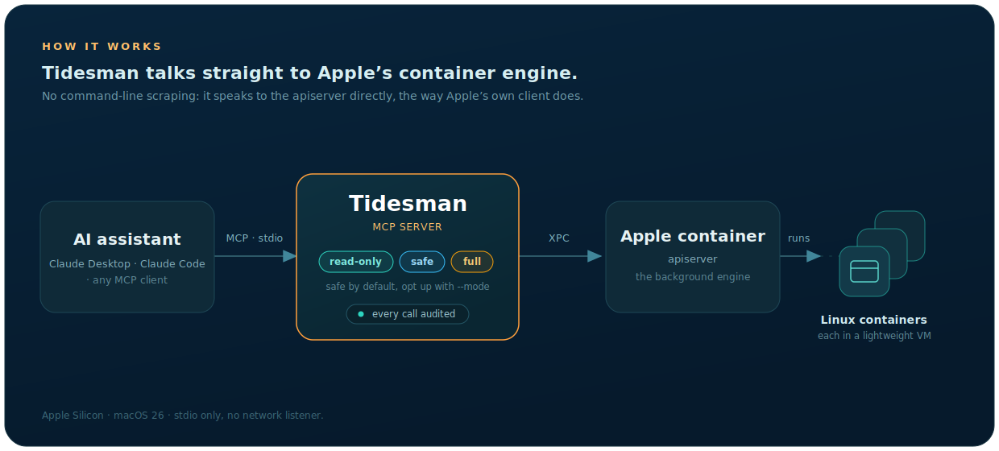

<p align="center">
  
</p>

<h1 align="center">Tidesman</h1>

<p align="center">
  A free native MCP server for running, understanding, and debugging Linux containers with Apple's <code>container</code> tool.
</p>

<p align="center">
  
  
  
  
  
</p>

<p align="center">
  <a href="https://tidesman.dev">Website</a> &middot;
  <a href="https://github.com/JeronimoColon/tidesman-mcp/releases">Downloads</a>
</p>

It lets an AI assistant (Claude Desktop, Claude Code, or any MCP-compatible client) list,
run, inspect, and clean up Linux containers on your Mac, safely and with a full audit trail.

> This repository is the public download and documentation home for Tidesman. The source is
> maintained privately; the binaries published here are signed with an Apple Developer ID
> certificate and notarized by Apple.

## Demo

<!-- A short screen recording is added here with the first release. -->
<p align="center"><em>Demo coming with the first release.</em></p>

## What it is

<p align="center">
  
</p>

MCP (Model Context Protocol) is an open standard that lets an AI assistant call external
tools: small functions that do real work, such as listing or starting containers. Tidesman is
the server side of that standard: it offers a set of container tools, and the AI is the client
that calls them.

Apple's `container` is Apple's tool for running Linux containers on macOS. Normally you drive
it by typing commands in a terminal. Tidesman instead talks straight to the background service
that `container` relies on (its "apiserver"), using Apple's own Swift client library. Going
directly to that service is faster and sturdier than wrapping the command line.

## Requirements

- An Apple Silicon Mac running macOS 26 (Apple's container runtime requires both).
- Apple's `container` installed and started: `container system start`.

## Install

Tidesman is a signed, notarized binary. Pick whichever channel suits you.

### Homebrew (recommended)

```
brew install JeronimoColon/tidesman/tidesman
```

This adds the tap and installs `tidesman` to `/opt/homebrew/bin`.

### Installer package (.pkg)

Download `tidesman-<version>.pkg` from the
[latest release](https://github.com/JeronimoColon/tidesman-mcp/releases/latest), double-click
it, and follow the prompts. It installs `tidesman` to `/usr/local/bin`. The package is signed,
notarized, and stapled, so it verifies even offline.

### Direct binary (zip)

Download `tidesman-<version>-macos-arm64.zip`, unzip it, and move `tidesman` onto your PATH.
Because the bare binary is not stapled, macOS checks it online the first time you run it.

### Claude Desktop one-click (.mcpb)

Download `tidesman-<version>.mcpb` and open it with Claude Desktop (Settings → Extensions). The
bundle embeds the signed binary and registers the server for you in read-only mode.

### Verify your download

Every release ships a `SHA256SUMS` file. From the folder holding your downloads:

```
shasum -c SHA256SUMS
```

## Configure your MCP client

Tidesman runs as a local command your client launches over standard input/output. Point the
client at the binary and pass an access mode with `--mode` (omit it for read-only).

Claude Desktop, edit `~/Library/Application Support/Claude/claude_desktop_config.json`:

```json
{
  "mcpServers": {
    "tidesman": {
      "command": "/opt/homebrew/bin/tidesman",
      "args": ["--mode=safe"]
    }
  }
}
```

Claude Code:

```bash
claude mcp add --transport stdio --scope user tidesman \
  -- /opt/homebrew/bin/tidesman --mode=safe
```

Any stdio MCP client (OpenAI Codex and others) works the same way: point it at the binary and
pass the flags as arguments.

## What it does

Twenty tools, each tagged by what it can do (Read, Write, or Destructive). Three report on
or repair the engine itself, eleven act on containers, six on images:

| Tool | Capability | What it does |
|---|---|---|
| `system_ping` | Read | check the container service is reachable |
| `system_disk_usage` | Read | report disk use for images, containers, and volumes |
| `system_repair` | Write | re-download the engine's own infrastructure images |
| `container_list` | Read | list containers |
| `container_inspect` | Read | show a container's full details |
| `container_logs` | Read | fetch a container's recent output |
| `container_run` | Write | create and start a container from an image |
| `container_exec` | Write | run a command inside a running container |
| `container_start` | Write | start an existing stopped container |
| `container_restart` | Write | gracefully stop and then start a container |
| `container_stop` | Write | gracefully stop a running container |
| `container_kill` | Write | stop a container by sending it a signal (SIGKILL by default) |
| `container_delete` | Destructive | remove a container |
| `container_prune` | Destructive | remove every stopped container in one sweep |
| `image_list` | Read | list the images already downloaded |
| `image_inspect` | Read | show an image's full details |
| `image_pull` | Write | download an image from a registry |
| `image_tag` | Write | give an existing image another name |
| `image_delete` | Destructive | remove an image |
| `image_prune` | Destructive | remove untagged (or all unused) images in one sweep |

What the capability tags mean: a **Read** tool observes state and changes nothing. A **Write**
tool changes state but never removes a resource; a stopped container survives a start or a
restart and an engine repair only restores what the engine needs. **Destructive** is reserved
for removing containers or images. Your MCP client may separately mark some write tools (exec,
stop, kill, restart) as destructive, based on the MCP hints each tool carries: those tools can
end work or change data inside a container, even though the container itself survives. In
every mode, all twenty tools stay visible to your assistant; a tool the mode locks says so in
its description and refuses until you raise the mode.

## Access modes: safe by default

Tidesman runs at one of three authority levels, set with `--mode=`, and it starts in the
safest one. If no `--mode` is given, it is read-only. Every tool is always listed to your
assistant; the mode controls which of them may run.

| Mode | Allows | Tools callable |
|---|---|---|
| `read-only` (default) | Read | ping, disk usage, list, inspect, logs, and the two image reads (7) |
| `safe` | Read + Write | the above, plus run, exec, start, restart, stop, kill, image pull and tag, and the engine repair (16) |
| `full` | Read + Write + Destructive | all twenty, including the delete and prune tools |

A separate flag, `--allow-host-mounts=/path/one[,/path/two]`, names the host folders
`container_run` may mount into a container; it is off by default because a host mount reaches
outside the container's isolation onto your real files. A mount is allowed only when its real
path (with symlinks resolved) sits under one of the folders you list.

## Security and trust

- Signed and notarized. The binary is signed with an Apple Developer ID certificate and
  notarized by Apple, so Gatekeeper runs it without a warning.
- Safe by default. Unset mode is read-only; destructive operations require `full`; host mounts
  require an explicit flag.
- Audited. Every tool call is recorded to `~/Library/Logs/tidesman/audit.log` and the macOS
  unified log: its name, its arguments (with secret-like values redacted), and its outcome.
  A destructive call also records exactly what it removed, and arguments a tool does not
  declare are recorded by name, so a mistaken call leaves a visible trace.
- Honest tool annotations. Every tool declares MCP read-only and destructive hints that match
  what it can actually touch, so your client knows the stakes and can ask before anything
  risky runs.
- Guard your client config. Tidesman's tools cannot change the access mode; it is pinned by
  the `--mode` argument in your MCP client's configuration file. That file lives outside
  Tidesman's control, so protect it accordingly: a client that grants its assistant broad
  filesystem access would let the assistant edit its own mode. Every audit-log line records
  the mode the call ran under, so any change leaves a visible trail.

## Privacy Policy

Tidesman collects nothing about you and sends nothing to us: no telemetry, no analytics, no
crash reporting, no accounts. Everything it does happens on your Mac.

- The audit log (tool calls, arguments with secret-like values redacted, outcomes) is written
  only to your Mac (`~/Library/Logs/tidesman/audit.log` and the macOS unified log) and stays
  there unless you share it yourself. Delete it whenever you like.
- Tidesman opens no network ports. Its only outbound connection is to a container registry
  (such as Docker Hub) when you or your assistant asks it to pull an image; that request shares
  the image name and your network address with the registry, like any container tool.
- Nothing is shared with, sold to, or retained by anyone else.

The full policy lives at [tidesman.dev/privacy.html](https://tidesman.dev/privacy.html).
Privacy questions: [legal@tidesman.dev](mailto:legal@tidesman.dev).

## License

Tidesman is proprietary software, provided free of charge under the end-user license in
[EULA.txt](EULA.txt). It bundles open-source components whose notices are preserved in
[THIRD-PARTY-LICENSES](THIRD-PARTY-LICENSES).

## Links

- Website: https://tidesman.dev
- Report an issue: https://github.com/JeronimoColon/tidesman-mcp/issues
- Contact: hello@tidesman.dev
